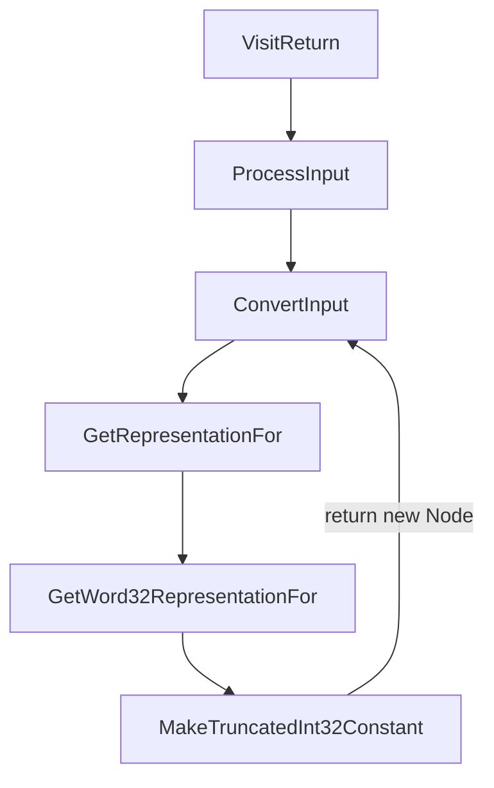
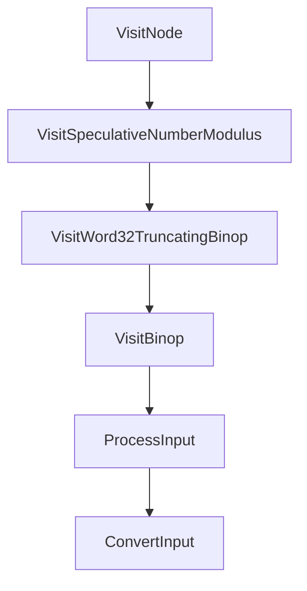
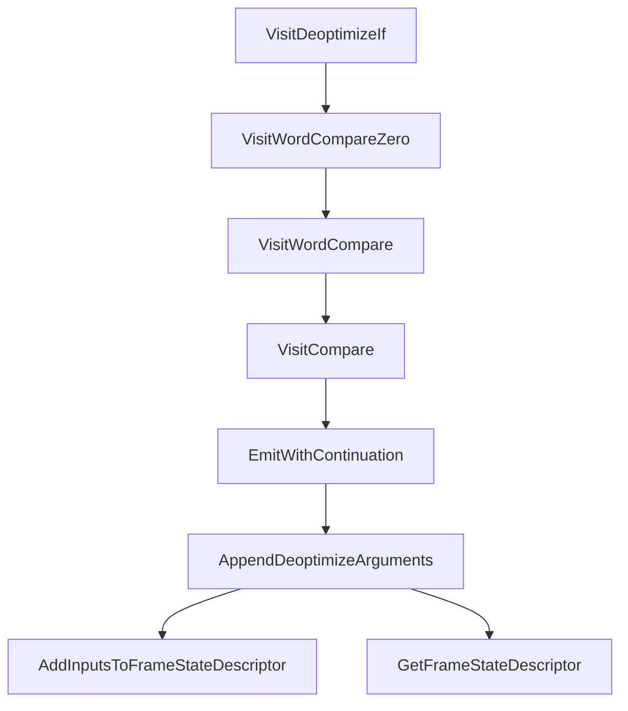
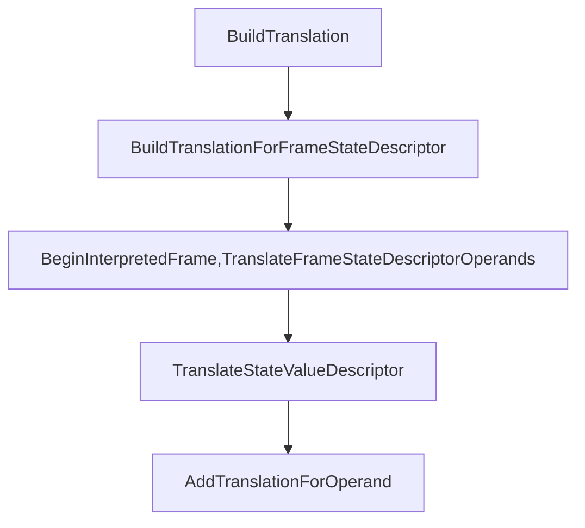

作为复现[Chrome Issue 1016450](https://bugs.chromium.org/p/chromium/issues/detail?id=1016450)的前置知识。

## Reference

[reference_1](https://tech-blog.cymetrics.io/posts/maxchiu/turbofan/)
, [reference_2](https://doar-e.github.io/blog/2020/11/17/modern-attacks-on-the-chrome-browser-optimizations-and-deoptimizations/#back-to-simplified-lowering)
, [reference_3](https://docs.google.com/presentation/d/1Z6oCocRASCfTqGq1GCo1jbULDGS-w-nzxkbVF7Up0u0/htmlpresent)

## Ignition

[ingnition reference](https://docs.google.com/document/d/11T2CRex9hXxoJwbYqVQ32yIPMh0uouUZLdyrtmMoL44/edit#heading=h.pmx14tjse3lt)

Ignition是作为V8的解释器而存在，Ignition是一个寄存器式的字节码虚拟机，也就是说在执行字节码执行过程中所涉及的输入和输出都保存在寄存器中，不涉及栈的操作（寄存器式虚拟机拥有更高的性能）。和之前在lox中实现的虚拟机一样，Ignition为每种byte code都实现了一个处理过程（handler）完成字节码的执行过程，**也包括在执行过程种对于推测信息的收集**。

之前已经粗略的学习过Ignition的字节码，**这一部分主要介绍Ignition的工作原理**。

以下面的这段js代码为例子：

```javascript
function outer()
{
  function test(a_1, a_2, a_3)
  {
    var a = 1;
    var b = 2;
    var c = a_1 + a_2 + a_3;  
    return a + b + c;
  }

  var x = 1;
  var y = 2;
  var z = 3;
  let res = test(x, y, z);
  return res;
}

var res = outer();
```

和lox很相似Ignition中的字节码也是按照函数为单位组织在一起的。当BytecodeGenerator在遍历AST时遇到函数调用时就会发出Call这个字节码，负责进行函数调用。一个Call字节码总共有三个参数，它们被保存在寄存器中：

- 第一个寄存器中保存的是即将被调用的函数。
- 第二个寄存器中保存的是调用传入的第一个参数的指针。
- 第三个寄存器中保存的是一共传入的参数的个数。

**在codegen的阶段BytecodeGenerator也会模拟出用于保存函数参数（lox是模拟栈中的情况），函数局部变量，临时变量的虚拟寄存器的状态，以便通过这些模拟的状态发出可以正确访问这些变量的字节码，另外计算register file的大小也需要在codegen阶段模拟所得到的值。**

在执行Call指令之前由BytecodeGenerator发出字节码将函数所需要的参数从其保存的位置（如果是全局变量那么就保存在全局符号表，如果是局部变量那么就保存在caller的虚拟寄存器中）加载到几个连续的虚拟寄存器中。看看上面例子中``outer()`对于`test()`函数的调用发出的字节码：


看到在Call之前发出了一系列的Mov指令将参数移动到连续的虚拟寄存器中。

然后进入到Call指令的handler中进行JS函数的调用：

- 第一步计算参数的个数。

  ```c++
  //interpreter/interpreter-assemebler.cc
  //CallJSAndDispatch()
    TNode<Word32T> args_count;
    if (receiver_mode == ConvertReceiverMode::kNullOrUndefined) {
      // The receiver is implied, so it is not in the argument list.
      args_count = args.reg_count();
    } else {
      // Subtract the receiver from the argument count.
      TNode<Int32T> receiver_count = Int32Constant(1);
      args_count = Int32Sub(args.reg_count(), receiver_count);
    }
  ```

  

- 然后调用`Generate_InterpreterPushArgsThenCallImpl()`将所有的参数和receiver object依次入栈。

- 在开始对函数中的字节码进行执行之前，Ignition会跳转到`InterpreterEntryTrampoline `进行函数执行之前的准备工作。使用内置函数`%DisassembleFunction(opt_me)`对函数反编译之后可以看到在进入`InterpreterEntryTrampoline `之前的蹦床代码：

  

  这段蹦床代码加载`InterpreterEntryTrampoline `的地址然后跳转。在`InterpreterEntryTrampoline `中将在执行字节码过程中常用的数据保存在对应的寄存器中：

  - 所有字节码都保存在一个BytecodeArray中将这个数组的地址保存在kInterpreterBytecodeArrayRegister这个专用的寄存器中。

    ```c++
    //builtin-x64.cc 
    //Generate_InterpreterEntryTrampoline()
    // Get the bytecode array from the function object and load it into
    // kInterpreterBytecodeArrayRegister.
      __ LoadTaggedPointerField(
          rax, FieldOperand(closure, JSFunction::kSharedFunctionInfoOffset));
      __ LoadTaggedPointerField(
          kInterpreterBytecodeArrayRegister,
    ```

  - 初始化callee的栈帧，包括:（代码见builtin-x64.cc `Generate_InterpreterEntryTrampoline()`）

    - 保存caller的Bytecode Array、offset用于恢复现场；
    - 和callee的JS Function和Context用于在执行过程中访问常量表和上下文；
    - 根据在codegen阶段模拟出的虚拟寄存器状态为这些虚拟寄存器分配(包括局部变量，临时变量)空间也就是register file。

    这个Turbofan部分的栈帧我还不太明白，可能是handler在执行前所构造的栈帧，而构造的代码是由turbofan生成的，因为handler都是由turbofan来编译的类似于CodeStubAssembler。

    最终的栈帧结构如下图所示:

     

  - 因为BytecodeArray也是一个数据结构，所以需要找到Bytecode在这个结构中开始的偏移，然后保存在kInterpreterBytecodeOffsetRegister这个专用寄存器中：

    ```c++
    //builtin-x64.cc 
    //Generate_InterpreterEntryTrampoline()  
    // Load initial bytecode offset.
      __ movq(kInterpreterBytecodeOffsetRegister,
              Immediate(BytecodeArray::kHeaderSize - kHeapObjectTag));
    ```

  - 在分发过程中所有的handler都被保存在一个table中，然后根据指令的操作码得到index去table中访问取出对应的handler执行对应的操作，这个table的起始地址将被保存在kInterpreterDispatchTableRegister这个专用寄存器中：

    ```c++
    //builtin-x64.cc 
    //Generate_InterpreterEntryTrampoline()
      // Load the dispatch table into a register and dispatch to the bytecode
      // handler at the current bytecode offset.
      Label do_dispatch;
      __ bind(&do_dispatch);
      __ Move(
          kInterpreterDispatchTableRegister,
          ExternalReference::interpreter_dispatch_table_address(masm->isolate()));
      __ movzxbq(r11, Operand(kInterpreterBytecodeArrayRegister,
                              kInterpreterBytecodeOffsetRegister, times_1, 0));
    ```

  - 然后根据上面寄存器中保存的一系列数据拿到处理第一个字节码的handler，`bytecode = kInterpreterBytecodeArrayRegister[kInterpreterBytecodeOffsetRegister];`，`handler = *(kInterpreterDispatchTableRegister + bytecode * pointer_size); `,拿到handler之后直接跳转到handler去执行。(handler的地址被保存在kJavaScriptCallCodeStartRegister这个专用寄存器中)。

    ```c++
    //builtin-x64.cc 
    //Generate_InterpreterEntryTrampoline() 
    __ movzxbq(r11, Operand(kInterpreterBytecodeArrayRegister,
                              kInterpreterBytecodeOffsetRegister, times_1, 0));
      __ movq(kJavaScriptCallCodeStartRegister,
              Operand(kInterpreterDispatchTableRegister, r11,
                      times_system_pointer_size, 0));
      __ call(kJavaScriptCallCodeStartRegister);
    ```

- 一旦进入handler中就代表离开了Trampoline重新进入了Ignition。在handler中负责完成指令的功能。

  ```c++
  // AddSmi <imm>
  //
  // Adds an immediate value <imm> to the value in the accumulator.
  IGNITION_HANDLER(AddSmi, InterpreterBinaryOpAssembler) {
    BinaryOpSmiWithFeedback(&BinaryOpAssembler::Generate_AddWithFeedback);
  }  
  
  void BinaryOpWithFeedback(BinaryOpGenerator generator) {
      TNode<Object> lhs = LoadRegisterAtOperandIndex(0);
      TNode<Object> rhs = GetAccumulator();
      TNode<Context> context = GetContext();
      TNode<UintPtrT> slot_index = BytecodeOperandIdx(1);
      TNode<HeapObject> maybe_feedback_vector = LoadFeedbackVector();
  
      BinaryOpAssembler binop_asm(state());
      TNode<Object> result = (binop_asm.*generator)(context, lhs, rhs, slot_index,
                                                    maybe_feedback_vector, false);
      SetAccumulator(result);
      Dispatch();
    }
  ```

  上面是对于二元字节码handler的具体实现，在`BinaryOpwithFeedback()`这个函数中完成取操作数的过程，然后调用

  由`BinaryOpAssembler::Generate_AddWithFeedback`所生成的代码来完成加法的计算和feedback info的设置，最后将结果写回累加器。

  **和lox的实现的不同之处在于handler在完成指令的功能之后并没有返回Trampoline，然后分发下一条指令。下一条指令的分发工作是在这条指令的handler结束时调用`Dispatch()`函数来完成的。只有当一个函数返回时才会回到trampoline中做收尾的工作将控制权重新交给caller。**

### Debug the Ignition

 想要使用V8提供的参数调试Ignition首先需要在编译参数中加入`v8_enable_trace_ignition = true`和`v8_enable_trace_feedbacks = true`。

然后可以使用下面的参数调试查看Ignition执行字节码的过程：

- --trace-ignition
- --trace_feedback_updates

还有一系列的内置调试函数：

- Runtime_InterpreterTraceBytecodeEntry
  - prints ignition registers before executing an opcode
- Runtime_InterpreterTraceBytecodeExit
  - prints ignition registers after executing an opcode
- Runtime_InterpreterTraceUpdateFeedback
  - displays updates to the feedback vector slots

下面是由`--trace-ignition`所打印出的Ignition在执行字节码过程中虚拟寄存器的变化：

```
      [          r1 -> 0x193680a1f8e9 <JSFunction add (sfi = 0x193680a1f759)> ]
      [          r2 -> 0x3ede813004a9 <undefined> ]
      [          r3 -> 42 ]
      [          r4 -> 1 ]
 -> 0x193680a1fa56 @    0 : a5                StackCheck 
 -> 0x193680a1fa57 @    1 : 25 02             Ldar a1
      [          a1 -> 1 ]
      [ accumulator <- 1 ]
 -> 0x193680a1fa59 @    3 : 34 03 00          Add a0, [0]
      [ accumulator -> 1 ]
      [          a0 -> 42 ]
      [ accumulator <- 43 ]
 -> 0x193680a1fa5c @    6 : a9                Return 
      [ accumulator -> 43 ]
 -> 0x193680a1f83a @   36 : 26 fb             Star r0
      [ accumulator -> 43 ]
      [          r0 <- 43 ]
 -> 0x193680a1f83c @   38 : a9                Return 
      [ accumulator -> 43 ]
```

## Simplified Lowering

[bug about simplified lowering](https://faraz.faith/2021-01-07-cve-2020-16040-analysis/)


然后具体学习一下simplified lowering，之前已经学过的CheckBounds Elimination就是simplified lowering的一部分，而在这一部分对simplified lowering做一个全面的学习。

simplified lowering一共包括三个部分：

- truncation propagation phase(`RunTruncationPropagationPhase()`)
  - 反向传播截断信息（使用信息）。
- The type propagation phase (`RunTypePropagationPhase`)
  - 正向传播类型信息，根据输入的feedback_type决定当前Node的feedback_type。
- The lowering phase (`Run`, after calling the previous phases)
  - 可能会简化Node，使Node更靠近机器码，更专用化。
  - 也有可能向SoN中插入convert Node，将一个Node转换为其他形式。

因为这些phase要对每种类型的Node进行处理，逻辑非常的复杂和庞大，**所以我们由一个例子开始追踪一部分simplified lowering的过程来理解这个截断所进行的优化。**

```javascript
function f(a) {
  if (a) {
    var x = 2;
  }
  else {
    var x = 5;
  }
  return 0x42 % x;
}
%PrepareFunctionForOptimization(f);
f(true);
f(false);
%OptimizeFunctionOnNextCall(f);
f(true);
```

在使用d8运行脚本时加上`--trace-representation`这个参数就可以打印出全部的simplified lowering的过程。

### truncation propagation phase (only propagate the truncation no representation)

这个phase将从End Node开始反向遍历整个SoN进行数据流分析。而这个数据流分析的具体内容就是截断传播。每个Node都有自己的依赖（input Node），其中数据依赖代表了一个Node需要使用的数据，而这些数据依赖的哪一部分将被User Node使用：word32（有些Node可能只关注输入数据的32位部分）, word64……这就是input Node的截断信息。

下面是截断信息的种类：

```c++
  enum class TruncationKind : uint8_t {
    kNone,
    kBool,
    kWord32,
    kWord64,
    kOddballAndBigIntToNumber,
    kAny
  };
```

**而一个input Node的截断信息，可能是由user的截断信息和Type等等来决定的。所以截断信息将沿着SoN的边在SoN上反向传播，最终每个Node都将被赋予自己的use info。**

truncation propagation phase的主要逻辑都在VisitNode这个函数中，当`phase_`这个变量为`PROPAGATE`时代表在VistiNode中进行截断传播。因为截断传播是在SoN中反向进行的所以从End结点开始。

```c++
  void VisitNode(Node* node, Truncation truncation,
                 SimplifiedLowering* lowering) {
  // ...
      case IrOpcode::kEnd:
       // ...
      case IrOpcode::kJSParseInt:
        VisitInputs(node);
        // Assume the output is tagged.
        return SetOutput(node, MachineRepresentation::kTagged);
```

其中`VisitInput()`函数是一个通用的访问者函数，什么是通用的访问函数？在`VisitNode()`中对于不同的Node，可能对于input有着不同的处理，但并不是对于所有的Node的Input的处理都不相同，部分Node的Input的处理过程是一致，这个时候需要有一个通用的处理函数来处理这一批的Node，他就是`VisitInput()`，在这个函数中简单的将所有的Value，context，framestate的Input都截断为AnyTagged，然后将所有的InputNode加入处理的队列。但是End Node只有control input所以这个函数除了入队之外没什么作用。

所以对于End Node的处理过程就是：InputNode入队，然后将Node的restriction_type设置为`Any`。


在处理output方面要了解一下`SetOutput()`这个函数：

```c++
  void SetOutput(Node* node, MachineRepresentation representation,
                 Type restriction_type = Type::Any()) {
    NodeInfo* const info = GetInfo(node);
    switch (phase_) {
      case PROPAGATE:
        info->set_restriction_type(restriction_type);
        break;
      case RETYPE:
        DCHECK(info->restriction_type().Is(restriction_type));
        DCHECK(restriction_type.Is(info->restriction_type()));
        info->set_output(representation);
        break;
      case LOWER:
        DCHECK_EQ(info->representation(), representation);
        DCHECK(info->restriction_type().Is(restriction_type));
        DCHECK(restriction_type.Is(info->restriction_type()));
        break;
    }
  }
```

这个函数根据`phase_`这个参数来选择处理的过程，在`PROPAGATE`阶段的工作就是为Node赋予**限制类型**，实际上我还不能太理解限制类型在整个simplified lowering中的作用，在后面的RETYPE阶段可以看到更多有关限制类型的代码，但是restrication_type，useinfo(截断信息)，feedback_type……都是作为数据流分析的结果被保存在NodeInfo中。

在处理完End Node之后会将Return Node入队：


接下来是对Return Node的处理：

```c++
 void VisitNode(Node* node, Truncation truncation,
                 SimplifiedLowering* lowering) {
    // ...
    switch (node->opcode()) {
      // ...
      case IrOpcode::kReturn:
        VisitReturn(node);
        // Assume the output is tagged.
        return SetOutput(node, MachineRepresentation::kTagged);
      // ...
    }
  }

  void VisitReturn(Node* node) {
    int tagged_limit = node->op()->ValueInputCount() +
                       OperatorProperties::GetContextInputCount(node->op()) +
                       OperatorProperties::GetFrameStateInputCount(node->op());
    // Visit integer slot count to pop
    ProcessInput(node, 0, UseInfo::TruncatingWord32());

    // Visit value, context and frame state inputs as tagged.
    for (int i = 1; i < tagged_limit; i++) {
      ProcessInput(node, i, UseInfo::AnyTagged());
    }
    // Only enqueue other inputs (effects, control).
    for (int i = tagged_limit; i < node->InputCount(); i++) {
      EnqueueInput(node, i);
    }
  }
```

对于Return Node的截断传播和End Node就有很大的不同了，首先Return Node的第一个参数代表了将要从栈中pop的slot的数量这个参数应该是一个整形，**所以Return Node希望这个Node以Word32这样的格式被使用，**所以传播给这个Node截断信息是Word32。其他的处理和End Node一致。最终的结果是：


在处理完Return之后继续向前：


​	先对NumberConstant Node作处理，这一部分做的工作就是将output设置为`Any`，细节可以在`VisitNode()`中查看。然后处理SpeculativeNumberModulus这个Node：

```c++
void VisitSpeculativeNumberModulus(Node* node, Truncation truncation,
                                     SimplifiedLowering* lowering) {
    if (BothInputsAre(node, Type::Unsigned32OrMinusZeroOrNaN()) &&
        (truncation.IsUsedAsWord32() ||
         NodeProperties::GetType(node).Is(Type::Unsigned32()))) {
      // => unsigned Uint32Mod
      VisitWord32TruncatingBinop(node);
      if (lower()) DeferReplacement(node, lowering->Uint32Mod(node));
      return;
    }
    ……
```


从图中观察SpeculativeNumberModulus的Input和它本身的Type是满足if语句的条件的，所以将会进入if分支然后调用`VisitWord32TruncatingBinop()`这个函数：

```c++
void VisitWord32TruncatingBinop(Node* node) {
	VisitBinop(node, UseInfo::TruncatingWord32(),
           	MachineRepresentation::kWord32);
}

void VisitBinop(Node* node, UseInfo input_use, MachineRepresentation output,
              Type restriction_type = Type::Any()) {
	VisitBinop(node, input_use, input_use, output, restriction_type);
}

// Helper for binops of the R x L -> O variety.
void VisitBinop(Node* node, UseInfo left_use, UseInfo right_use,
              MachineRepresentation output,
              Type restriction_type = Type::Any()) {
	DCHECK_EQ(2, node->op()->ValueInputCount());
	ProcessInput(node, 0, left_use);
	ProcessInput(node, 1, right_use);
	for (int i = 2; i < node->InputCount(); i++) {
  	EnqueueInput(node, i);
	}
	SetOutput(node, output, restriction_type);
}

void ProcessInput(Node* node, int index, UseInfo use) {
    DCHECK_IMPLIES(use.type_check() != TypeCheckKind::kNone,
                   !node->op()->HasProperty(Operator::kNoDeopt) &&
                       node->op()->EffectInputCount() > 0);

    switch (phase_) {
      case PROPAGATE:
        EnqueueInput(node, index, use);
        break;
      case RETYPE:
        break;
      case LOWER:
        ConvertInput(node, index, use);
        break;
    }
  }
```

经过一连串的函数调用最终造成的结果是：

- 调用`ProcessInput()`向前两个input node传递Word32的截断信息，表明SpeculativeNumberModulus要以word32的格式来使用前两个input。
- 调用`SetOutput()`为Node赋予Any的限制类型。
- 将所有的input Node入队。

最后的处理结果也可以从--trace-represention的打印结果中印证：


最后处理的是Merge Node，它的处理过程和End Node一致：

```c++
  void VisitNode(Node* node, Truncation truncation,
                 SimplifiedLowering* lowering) {
  // ...
      case IrOpcode::kMerge:
      // ...
      case IrOpcode::kJSParseInt:
        VisitInputs(node);
        // Assume the output is tagged.
        return SetOutput(node, MachineRepresentation::kTagged);
```

这样就跟着SoN走完了几个Node的truncation propagation阶段，可以看出truncation propagation的作用是：**反向遍历整个SoN，为每个User Node使用的Data Input Node添加截断信息，表示这个Input将被User Node如何使用。在整个truncation propagation结束之后，每个Node的NodeInfo中保存了这个Node的截断信息。**

### Retype phase

在ReType phase中从End Node开始将所有的Node入栈，然后从栈顶开始遍历所有的Node。Retype阶段的工作分成两部分：

- 就像这个phase的名字一样，在这个阶段对每个Node重新计算Node，**因为在truncation propagation中为Node添加了restrication_type，这表示根据Node的种类为Node Type添加的新的限制，所以Type需要重新计算**。计算完成的Type将被保存在NodeInfo的feedback_type_字段。
- 然后在`SetOutput()`中为每个Node设置输出，表示这个Node输出的数据格式。(这个也是根据feedback_type来设置的)

#### Update feedback_type

我们从第一个部分来说,因为上面的例子feedback_type的更新不明显，所以在这一部分换一个例子来观察：

```c++
function assertFalse(c) {
    assertTrue(!c);
}

function foo(a) {
  var y = 0x7fffffff;  // 2^31 - 1

  // Widen the static type of y (this condition never holds).
  if (a == NaN) y = NaN;

  // The next condition holds only in the warmup run. It leads to Smi
  // (SignedSmall) feedback being collected for the addition below.
  if (a) y = -1;

  const z = (y + 1)|0;
  return z < 0;
}

%PrepareFunctionForOptimization(foo);
assertFalse(foo(true));
%OptimizeFunctionOnNextCall(foo);
assertTrue(foo(false));
```

在这个例子中我们的关注点在`z = (y + 1) | 0`对这个表达式中的`+`所产生的SpeculativeSafeIntegerAdd Node的Retype 过程。首先之所以这个`+`会产生SpeculativeSafeIntegerAdd是因为在优化前的这一次运行中Ignition所收集到的feedback info这个加法是两个smi之间的加法，所以它将产生SpeculativeSafeIntegerAdd Node代表这一次加法。

在SoN中它是下面的这个样子：


先来看一下Retype的结果：

```
--{Retype phase}--
[ ... ]
#39:Phi[kRepTagged](#32:Phi, #38:NumberConstant, #36:Merge)  [Static type: (NaN | Range(-1, 2147483647))]
 visit #39: Phi                                                                 
  ==> output kRepFloat64                                                        
 visit #42: NumberConstant                                                      
  ==> output kRepTaggedSigned                                                   
#43:SpeculativeSafeIntegerAdd[SignedSmall](#39:Phi, #42:NumberConstant, #22:SpeculativeNumberEqual, #36:Merge)  [Static type: Range(0, 2147483648), Feedback type: Range(0, 2147483647)]
 visit #43: SpeculativeSafeIntegerAdd                                           
  ==> output kRepWord32
[ ... ]
```

直接来看一下SpeculativeSafeIntegerAdd 这个Node它被编号为43，在这个Node所对应的第一行结果中可以看到一共有两个Type：

- static type：代表的是Node在Typer阶段所打上的类型。
- Feedback type：代表Node在Retype phase中重新计算的type。

而这两个type是不同的，接下来通过跟踪对于SpeculativeSafeIntegerAdd 的Retype过程来搞清楚为什么这两个type是不同的。

```c++
void RunTypePropagationPhase() {
	[ ... ]
	Node* node = current.node;
      typing_stack_.pop();
      NodeInfo* info = GetInfo(node);
      info->set_visited();
      bool updated = UpdateFeedbackType(node);
      TRACE(" visit #%d: %s\n", node->id(), node->op()->mnemonic());
      VisitNode(node, info->truncation(), nullptr);
      TRACE("  ==> output ");
      PrintOutputInfo(info);
      TRACE("\n");
      if (updated) {
        for (Node* const user : node->uses()) {
          if (GetInfo(user)->visited()) {
            GetInfo(user)->set_queued();
            queue_.push(user);
          }
        }
      }
    [ ... ]
```

在将所有的Node都加入栈中之后将从栈顶开始遍历所有的Node，其中Retype的逻辑都在`UpdateFeedbackType`这个函数中。

```c++
  bool UpdateFeedbackType(Node* node) {
    if (node->op()->ValueOutputCount() == 0) return false;
    
    NodeInfo* info = GetInfo(node);
    Type type = info->feedback_type();
    Type new_type = NodeProperties::GetType(node);

    if (node->opcode() != IrOpcode::kPhi) { // [ 1 ]
      // [ ... ]
    }


    // We preload these values here to avoid increasing the binary size too
    // much, which happens if we inline the calls into the macros below.
    Type input0_type;
    if (node->InputCount() > 0) input0_type = FeedbackTypeOf(node->InputAt(0));
    Type input1_type;
    if (node->InputCount() > 1) input1_type = FeedbackTypeOf(node->InputAt(1));

    switch (node->opcode()) {
      // [ ... ]
#define DECLARE_CASE(Name)                                               \
  case IrOpcode::k##Name: {                                              \
    new_type = Type::Intersect(op_typer_.Name(input0_type, input1_type), \
                               info->restriction_type(), graph_zone());  \
    break;                                                               \
  }
      SIMPLIFIED_SPECULATIVE_NUMBER_BINOP_LIST(DECLARE_CASE)
      SIMPLIFIED_SPECULATIVE_BIGINT_BINOP_LIST(DECLARE_CASE)
#undef DECLARE_CASE

      // [ ... ]
    }
    new_type = Type::Intersect(GetUpperBound(node), new_type, graph_zone());

    if (!type.IsInvalid() && new_type.Is(type)) return false;
    GetInfo(node)->set_feedback_type(new_type);
    if (FLAG_trace_representation) {
      PrintNodeFeedbackType(node);
    }
    return true;
  }
```

首先在[1]处的if语句保证除了Phi Node之外其他所有种类的Node在进行Retype之前，所有的Input Node都已经Retype完毕。之后从两个Data Input Node的NodeInfo取出feedback_type:

- input0_type：`NaN | Range(-1, 2147483647)` - The `Phi` node
- input1_type: `Range(1, 1)` - The `NumberConstant[1]` node

而此时的new_type是SpeculativeSafeIntegerAdd Node的static type也就是`Range(0, 2147483648)`。

既然要对Node进行Retype那么就要生成新的type：

```c++
new_type = Type::Intersect(op_typer_.Name(input0_type, input1_type), \
                               info->restriction_type(), graph_zone());
```

上面这行代码将为SpeculativeSafeIntegerAdd 生成新的Type，结果是一个交集：

- 交集的第一个操作数是调用Typer的`SpeculativeSafeIntegerAdd()`函数为这个Node重新计算的Node Type，因为在Retype过程中SpeculativeSafeIntegerAdd Node的Input Type已经被为新的feedback_type，所以要重新计算。计算的结果是`Range(0, 2147483648)`。

- 第二个操作数是SpeculativeSafeIntegerAdd Node的restriction_type，这个Type是在truncation propgation阶段为Node所添加的限制类型。这个时候我们需要重新回到truncation propogation阶段：

  ```c++
  void VisitSpeculativeIntegerAdditiveOp(Node* node, Truncation truncation,
                                           SimplifiedLowering* lowering) {
      Type left_upper = GetUpperBound(node->InputAt(0));
      Type right_upper = GetUpperBound(node->InputAt(1));
  
      if (left_upper.Is(type_cache_->kAdditiveSafeIntegerOrMinusZero) &&
          right_upper.Is(type_cache_->kAdditiveSafeIntegerOrMinusZero)) {//[ 1 ]
          
        }
      NumberOperationHint hint = NumberOperationHintOf(node->op());
      DCHECK(hint == NumberOperationHint::kSignedSmall ||
             hint == NumberOperationHint::kSigned32);
  
      Type left_feedback_type = TypeOf(node->InputAt(0));
      Type right_feedback_type = TypeOf(node->InputAt(1));
      Type left_constraint_type =
          node->opcode() == IrOpcode::kSpeculativeSafeIntegerAdd
              ? Type::Signed32OrMinusZero()
              : Type::Signed32();
      if (left_upper.Is(left_constraint_type) &&
          right_upper.Is(Type::Signed32OrMinusZero()) &&
       (left_upper.Is(Type::Signed32()) || right_upper.Is(Type::Signed32()))) {//[ 2 ]
      } else {//[ 3 ]
        IdentifyZeros left_identify_zeros = truncation.identify_zeros();
        if (node->opcode() == IrOpcode::kSpeculativeSafeIntegerAdd &&
            !right_feedback_type.Maybe(Type::MinusZero())) {
          left_identify_zeros = kIdentifyZeros;
        }
        UseInfo left_use = CheckedUseInfoAsWord32FromHint(hint, FeedbackSource(),
                                                          left_identify_zeros);
        UseInfo right_use = CheckedUseInfoAsWord32FromHint(hint, FeedbackSource(),
                                                           kIdentifyZeros);
        VisitBinop(node, left_use, right_use, MachineRepresentation::kWord32,
                   Type::Signed32());//[ 3 ]
      }
      [ ... ]
      return;
    }
  ```

  其中[1]和[2]的if分支都不会被执行，因为Phi Node的Type中含有NaN，最后被执行的是[3]处的代码。这个函数会为SpeculativeSafeIntegerAdd Node赋予**Signed32**的restriction_type。

**而Signed32写成Range的形式是Range(-2147483648, 2147483647)，所以要计算的是的new_type是 Range(-2147483648, 2147483647) $\bigcap$ Range(0, 2147483648)，计算之后是Range(0, 2147483647)**。这个Type将被赋给NodeInfo的feedback_type_字段，代表这个Node重新获得的Type。最终通过读代码所得出的结果和--trace-representation中打印的结果一样。

所以static type和feedback type不同的原因就出在新增的restriction_type。上面就是一个Node Retype的全部过程，在这个过程所有Node的Node Info的feedback_type_字段都会被更新，但是更新之后的feedback_type可能和static type是一样的，比如Phi Node。

#### Set representation

然后就是retype phase的第二阶段，为每个Node设置representation。这一部分的内容比较少。

这部分的工作都是在`VisitiNode()`函数中完成。`VisitNode()`将根据Node的operator，选择正确的过程为Node设置representation也就是Node所产生数据的格式。而在这个过程中将参考Node的operator，input Node Type，hint多种因素来为Node设置output representation。 

还是拿update feedback_type中的例子来说明。对于其中的SpeculativeSafeIntegerAdd Node，当`UpdateFeedback()`函数结束之后就会进入`VisitNode()`函数，然后进入`VisitSpeculativeIntegerAdditiveOp()`函数，上面已经讨论过在这个函数中最终将执行的是[3]处的代码：

```c++
VisitBinop(node, left_use, right_use, MachineRepresentation::kWord32,
                 Type::Signed32());//[ 3 ]
```

这段代码在truncation propagation阶段的作用是：1.传播截断信息。2.设置限制类型，但是在Retype阶段它将调用`Setoutput()`为Node设置output representation：

```c++
  void SetOutput(Node* node, MachineRepresentation representation,
                 Type restriction_type = Type::Any()) {
    NodeInfo* const info = GetInfo(node);
    switch (phase_) {
      [ ... ]
      case RETYPE:
        DCHECK(info->restriction_type().Is(restriction_type));
        DCHECK(restriction_type.Is(info->restriction_type()));
        info->set_output(representation);
        break;
      [ ... ]
```

所以最终NodeInfo的`representation_`将被设置为Word32。这个`representation_`代表了这个Node所产生的数据的格式，它将在最后的Lowering Phase中为格式转换提供信息。

### Lowering Phase

到现在为止SL阶段已经经历了两轮的数据流分析：

- 通过Truncation Propagation我们知道了，每个Node的UseInfo也就是这个Node所产生的数据要怎么被user Node使用（以什么格式）。
- 通过Retype Phase我们根据每个Nodeode的特点为它重新设置Type，另外也知道了每个Node将产生什么样格式的数据。

现在的问题是：

- 当UseInfo所指定的representation和Output的representation不一样该怎么办？
- 另外就是现在已经知道了Node将要产生的数据格式如何对Node进行进一步的简化使它更加靠近机器码？

这个就是在Lowering Phase要解决的问题。这部分的工作也都是在`VisitNode()`中完成的，当`phase_`参数为LOWER时就进入了Lowering Phase也是SL的最后一个阶段。

在这个阶段也是从End Node开始反向遍历整个SoN，在访问每个Node n时可能有两件事情要做：

- 对n的Input Node n‘进行检查如果发现n'的UseInfo和Output representation不符，通过转换n'的operator（NumberConstant），**或者在n'和n之间插入格式转换结点（other node）**，使产生的数据格式可以满足UseInfo的要求。一般通过`convertInput()`函数来完成这部分工作。
- 除了处理Input之外，Lowering Phase还参考UseInfo和Type对n进行Lowering的操作，**将n转换为更加低级更加专用的operator，然后替换掉n**。一般通过`DeferReplacement()`函数来完成替换的工作，也有些Node也会被直接替换掉operator来完成Lowering（SpeculativeIntegerAdd）。

再Lowering阶段并不是所有的Node都将被改变，部分Node将保持不变。 

我们还是参考第一个例子的SoN，追踪一部分的Lowering Phase来学习Lowering究竟是如何工作。

首先从Return Node开始，在`VisitNode()`中将调用`VisitReturn()`对Return Node的的两个Data Input进行Lowering，首先第一个Input Node：


调用链是这样的`VisitReturn()`-->`ProcessInput()`-->`convertInput()`，在`convertInput()`将收集一系列的信息：UseInfo，representation...然后调用`GetRepresentationFor()`为#29 Node选择合适的转换结点。`GetRepresentationFor()`将根据UseInfo的representation == kWord32跳转到`GetWord32RepresentationFor()`在这个函数中再调用`MakeTruncatedInt32Constant()`创建一个Int32Constant Node并返回：

```c++
Node* RepresentationChanger::GetWord32RepresentationFor(
    Node* node, MachineRepresentation output_rep, Type output_type,
    Node* use_node, UseInfo use_info) {
  // Eagerly fold representation changes for constants.
  switch (node->opcode()) {
    case IrOpcode::kInt32Constant:
    case IrOpcode::kInt64Constant:
    case IrOpcode::kFloat32Constant:
    case IrOpcode::kFloat64Constant:
      UNREACHABLE();
    case IrOpcode::kNumberConstant: {
      double const fv = OpParameter<double>(node->op());
      if (use_info.type_check() == TypeCheckKind::kNone ||
          ((use_info.type_check() == TypeCheckKind::kSignedSmall ||
            use_info.type_check() == TypeCheckKind::kSigned32 ||
            use_info.type_check() == TypeCheckKind::kNumber ||
            use_info.type_check() == TypeCheckKind::kNumberOrOddball ||
            use_info.type_check() == TypeCheckKind::kArrayIndex) &&
           IsInt32Double(fv))) {
        return MakeTruncatedInt32Constant(fv);
      }
      break;
    }
    default:
      break;
  }
  [ ... ]
}
    
Node* RepresentationChanger::MakeTruncatedInt32Constant(double value) {
  return jsgraph()->Int32Constant(DoubleToInt32(value));
}
```



返回后由`convertInput`负责用new Node替换掉原来旧的Node。

```
visit #30: Return
  change: #30:Return(@0 #29:NumberConstant)  from kRepTaggedSigned to kRepWord32:truncate-to-word32
```

然后是第二个Input Node：


对于这个Input Node的转换过程和#29基本上一样直到`GetRepresentationFor()`函数这两个Node的处理过程出现了差异：

- 在对于#29 Node来说`GetRepresentationFor()`做的是根据UseInfo生成了一个新的Constant Node，然后替换掉原有的#29 Node。这是由#29 是一个NumberConstant Node的特殊性来决定的。
- 对于非NumberConstant Node，`GetRepresentationFor()`做的是根据UseInfo和Output representation生成一个convert node ChangeInt31ToTaggedSinged，然后将这个Node插入到#28和#30之间，不会覆盖掉原有的Node，只是对输出结果的一次转换。

```c++
Node* RepresentationChanger::GetTaggedRepresentationFor(
    Node* node, MachineRepresentation output_rep, Type output_type,
    Truncation truncation) {
    [ ... ]
    else if (IsWord(output_rep)) {
    if (output_type.Is(Type::Signed31())) {
      op = simplified()->ChangeInt31ToTaggedSigned();
    [ ... ]
    return jsgraph()->graph()->NewNode(op, node); 
}
```

其中output_type指的是#28的feedback_type是Range(0, 4)所以属于Signed31，因此op被赋值为ChangeInt31ToTaggedSigned。然后调用NewNode生成新的转换结点，并将#28作为Data Input。完成new Node的生成工作之后一路返回到ConvertInput并使用生成的new node替换掉#28，**实际上最终的效果就是在#28和#30之间插入了ChangeInt31ToTaggedSigned Node**。

```
visit #30: Return
  change: #30:Return(@1 #28:SpeculativeNumberModulus)  from kRepWord32 to kRepTagged:no-truncation (but distinguish zeros)
```

最后我们看一下SpeculativeNumberModulus  Node是如何在Lowering Phase阶段被处理的。

```
void VisitSpeculativeNumberModulus(Node* node, Truncation truncation,
                                     SimplifiedLowering* lowering) {
    if (BothInputsAre(node, Type::Unsigned32OrMinusZeroOrNaN()) &&
        (truncation.IsUsedAsWord32() ||
         NodeProperties::GetType(node).Is(Type::Unsigned32()))) {
      // => unsigned Uint32Mod
      VisitWord32TruncatingBinop(node);[ 1 ]
      if (lower()) DeferReplacement(node, lowering->Uint32Mod(node));[ 2 ]
      return;
    }
    [ ... ]
 }
```

在[1]处`VisitNode()`将调用`VisitSpeculativeNumberModulus()`对#28进行Lowering，首先和Return Node一样是对于Input Node的convertion：



使用一条和Return Node相似的调用链调用`convertInput`将Input Node转换为UseInfo指定的格式。

然后将在[2]处调用`DeferReplacement()`函数对#28进行简化，具体的简化过程由`Uint32Mod()`完成，这个函数将#28简化为一系列的低级Node：

```c++
Node* SimplifiedLowering::Uint32Mod(Node* const node) {
  Uint32BinopMatcher m(node);
  Node* const minus_one = jsgraph()->Int32Constant(-1);
  Node* const zero = jsgraph()->Uint32Constant(0);
  Node* const lhs = m.left().node();
  Node* const rhs = m.right().node();

  if (m.right().Is(0)) {
    return zero;
  } else if (m.right().HasValue()) {
    return graph()->NewNode(machine()->Uint32Mod(), lhs, rhs, graph()->start());
  }

  // General case for unsigned integer modulus, with optimization for (unknown)
  // power of 2 right hand side.
  //
  //   if rhs == 0 then
  //     zero
  //   else
  //     msk = rhs - 1
  //     if rhs & msk != 0 then
  //       lhs % rhs
  //     else
  //       lhs & msk
  //
  // Note: We do not use the Diamond helper class here, because it really hurts
  // readability with nested diamonds.
  const Operator* const merge_op = common()->Merge(2);
  const Operator* const phi_op =
      common()->Phi(MachineRepresentation::kWord32, 2);

  Node* check0 = graph()->NewNode(machine()->Word32Equal(), rhs, zero);
  Node* branch0 = graph()->NewNode(common()->Branch(BranchHint::kFalse), check0,
                                   graph()->start());

  Node* if_true0 = graph()->NewNode(common()->IfTrue(), branch0);
  Node* true0 = zero;

  Node* if_false0 = graph()->NewNode(common()->IfFalse(), branch0);
  Node* false0;
  {
    Node* msk = graph()->NewNode(machine()->Int32Add(), rhs, minus_one);

    Node* check1 = graph()->NewNode(machine()->Word32And(), rhs, msk);
    Node* branch1 = graph()->NewNode(common()->Branch(), check1, if_false0);

    Node* if_true1 = graph()->NewNode(common()->IfTrue(), branch1);
    Node* true1 = graph()->NewNode(machine()->Uint32Mod(), lhs, rhs, if_true1);

    Node* if_false1 = graph()->NewNode(common()->IfFalse(), branch1);
    Node* false1 = graph()->NewNode(machine()->Word32And(), lhs, msk);

    if_false0 = graph()->NewNode(merge_op, if_true1, if_false1);
    false0 = graph()->NewNode(phi_op, true1, false1, if_false0);
  }

  Node* merge0 = graph()->NewNode(merge_op, if_true0, if_false0);
  return graph()->NewNode(phi_op, true0, false0, merge0);
}
```

在针对SpeculativeNumberModulus产生一系列简化的Node之后，`DeferReplacement()`负责使用这些低级Node替代掉原来的#28：

```c++
void DeferReplacement(Node* node, Node* replacement) {
    TRACE("defer replacement #%d:%s with #%d:%s\n", node->id(),
          node->op()->mnemonic(), replacement->id(),
          replacement->op()->mnemonic());

    // Disconnect the node from effect and control chains, if necessary.
    if (node->op()->EffectInputCount() > 0) {
      DCHECK_LT(0, node->op()->ControlInputCount());
      // Disconnect the node from effect and control chains.
      Node* control = NodeProperties::GetControlInput(node);
      Node* effect = NodeProperties::GetEffectInput(node);
      ReplaceEffectControlUses(node, effect, control);
    }

    replacements_.push_back(node);
    replacements_.push_back(replacement);

    node->NullAllInputs();  // Node is now dead.
  }
```

这个函数是它不是立即用生成的新Node来替换旧的Node，就像他的名字一样它是推迟替代。如果旧的Node拥有effect edge那么先将这个Node从effect edge和control edge上脱去，然后将这个旧的Node和新的Node一起放入栈中，直到某个时机对这些Node一起替换。例子中最终替换的结果如下：


到这里SL的三个阶段就全部结束。

## Deoptimization

因为JavaScript是一款动态类型语言，这意味着对于一个变量的操作（比如加法）需要能正确的处理各种类型的变量（加法需要检查左右操作书的类型：数字，字符串，对象……以正确处理变量间的加法），这样将导致程序缓慢的运行速度。即便将这样的JS代码编译为汇编代码，程序的速度依然不能和静态类型语言程序媲美。**所以为了在对JS代码进行优化时获得一部分类型信息，V8提出了一种优化思路——推测优化**。

V8首先将JS代码编译为字节码，并交给字节码虚拟机Ignition运行，这时程序的运行是慢速的，在这个过程中Ignition除了对字节码解释执行之外，**还将在运行的过程中收集运行的信息：对于一个加法操作来说，Ignition将在解释的过程中收集操作数的类型信息。**当一个函数变得hot的时候，将由Turbofan对这个函数进行优化，turbofan将根据这些运行时收集的信息生成针对对应类型的汇编代码，这样就不需要处理多种类型的变量，程序的速度也会变的更快。

但是这个优化是基于推断的，Ignition所收集的信息可能是基于之前10000次的运行所综合得到的，但是如果在下一次运行的过程中传入变量的类型发生变化，将意味着优化所生成的代码是错误的，再继续使用优化代码将导致不可预料的结果。为了解决这个问题V8引入了deoptimization机制。

V8拥有多种deoptimization机制：

- eager deoptimization：turbofan将为每一个可能引发deoptimization的结点（使用了推测的类型信息）前插入一个CheckPoint检查优化的类型前提还是否正确，如果类型正确那么继续执行优化代码，如果类型不正确，那么优化代码就不能再继续使用，接下来执行`DeoptimizationExit`退出优化代码返回字节码。
- lazy deoptimization：只使用eager deoptimization将导致在SoN中插入过多的CheckPoint为了，过多的Check无疑会拖累程序的运行速度，所以为了提高程序的执行效率，V8又引入了lazy deoptimization。以全局变量为例子，和eager不同的是：lazy注册从全局变量到优化函数的依赖关系，当全局变量被改变时，就触发对应函数的去优化。这样可以减少CheckPoint的数量，提高程序的运行速度。

- soft deoptimization：函数优化得太早，需要更多的反馈。（不太了解这个优化）

### trace the deoptimization

接下来就需要讨论一下deoptimization过程中的具体工作，deoptimization的最终目标是返回字节码继续执行，但是它的工作不仅仅只是销毁优化代码然后返回字节码执行这么简单，为了可以正常执行字节码在返回到Ignition之前需要先恢复Ignition的栈帧。**在这个过程涉及到一个转换过程，从优化代码栈帧转换到interpreted frame。**

首先Deoptimization代码是由类似下面这样的Node产生的：


#### SelectInstructPhase

在所有的优化phase结束之后将进入**SelectInstructPhase**，在这个phase中将SoN转换成另一种更具体的低级IR，为最终的code generation做准备。当遍历到这样的Deoptimize Node，将有两种情况：

- Deoptimize Node：将生成kArchDeoptimize这样的Instruction。

  ```c++
  void InstructionSelector::VisitDeoptimize(DeoptimizeKind kind,
                                            DeoptimizeReason reason,
                                            FeedbackSource const& feedback,
                                            Node* value) {
    //emit the kArchDeoptimize Instruction
    EmitDeoptimize(kArchDeoptimize, 0, nullptr, 0, nullptr, kind, reason,
                   feedback, value);
  }
  ```

- DeoptimizeIf Node：为其他的Node添加kFlags_deoptimize这样的标志位。

  ```c++
  void InstructionSelector::VisitDeoptimizeIf(Node* node) {
    DeoptimizeParameters p = DeoptimizeParametersOf(node->op());
    if (NeedsPoisoning(p.is_safety_check())) {
      FlagsContinuation cont = FlagsContinuation::ForDeoptimizeAndPoison(
          kNotEqual, p.kind(), p.reason(), p.feedback(), node->InputAt(1));
      VisitWordCompareZero(node, node->InputAt(0), &cont);
    } else {
    //ForDeoptimize will add the kFlags_deoptimize for the compare node
      FlagsContinuation cont = FlagsContinuation::ForDeoptimize(
          kNotEqual, p.kind(), p.reason(), p.feedback(), node->InputAt(1));
      VisitWordCompareZero(node, node->InputAt(0), &cont);
    }
  }
  ```

  而拥有kFlags_deoptimize这样的标志位将导致在code generation阶段为这条指令生成一个跳转向Deoptimization的分支。

  

以上的两种情况都表示在这个位置需要进行Deoptimize，那就必然要进行上面所提到的转换，这个转换过程需要一个Input Data指导转换的进行，在V8中被叫做**Translation**：


Translation将指导进行哪种deoptimization，去优化之后返回到字节码的那个位置，要向Output Frame种填充哪些值怎么样转换这些值（从Input Frame的哪里读出这些值）。**而Translation的创建则是根据FrameState和StateValue这两种结点进行的：**

- FrameState：代表了一个位置Interpret Frame栈帧的状态。
- StateValue：代表了当前状态栈帧中具体的一个值（Context,this object,args……）

这两种结点在**SelectInstructPhase**没有对应的访问函数，也就是说这两种结点不会生成对应的指令。但是当在**SelectInstructPhase**访问使用了FrameState的Deoptimize Node时，将会根据Deoptimize Node使用的FrameState和StateValue生成对应的**FrameStateDescriptor**和**StateValueDescriptor**。下面是在**SelectInstructPhase**访问DeoptimizeIf Node生成两种数据结构的调用链：



而Translation的生成正式依赖于这两个数据结构，这样生成Translation的前置工作就完成了。

#### code generate

当**SelectInstructPhase**结束之后将进入最后的code generate阶段。

在这个阶段将为每个Deoptimize结点生成Translation，调用`BuildTranslation()`函数。它将有一条这样的调用链



下面是FrameStateDescriptor和Translation之间的对应关系。创建好的Translation将作为Deoptimize的Input Data指导Deoptimization构建Interpreted Frame。


再往后将生成和Translation相关的Deoptimization code，这样当因为优化的某些前置条件被打破时就会跳转到这部分代码进行Deoptimize。

### Example

以下面的这段JS代码作为例子，看一下在Deoptimization过程中如何进行Frame的转换过程：

```javascript
function add_prop(x) {
let obj = {};
obj[x] = 42;
}

add_prop("x");
%PrepareFunctionForOptimization(add_prop);
add_prop("x");
add_prop("x");
add_prop("x");
%OptimizeFunctionOnNextCall(add_prop);
add_prop("x");
add_prop("different");
```

在d8运行时添加下面两条参数打印turbofan生成优化代码的详细细节：

- --turbo-profiling
- --print-code-verbose

下面是打印出的Deoptimization的Input Data：

```
Deoptimization Input Data (deopt points = 5)
 index  bytecode-offset    pc  commands
     0                0   269  BEGIN {frame count=1, js frame count=1, update_feedback_count=0}
                               INTERPRETED_FRAME {bytecode_offset=0, function=0x3ee5e83df701 <String[#8]: add_prop>, height=1, retval=@0(#0)}
                               STACK_SLOT {input=3}
                               STACK_SLOT {input=-2}
                               STACK_SLOT {input=-1}
                               STACK_SLOT {input=4}
                               LITERAL {literal_id=2 (0x3ee5f5180df9 <Odd Oddball: optimized_out>)}
                               LITERAL {literal_id=2 (0x3ee5f5180df9 <Odd Oddball: optimized_out>)}

// ...

     2                6    NA  BEGIN {frame count=1, js frame count=1, update_feedback_count=0}
                               INTERPRETED_FRAME {bytecode_offset=6, function=0x3ee5e83df701 <String[#8]: add_prop>, height=1, retval=@0(#0)}
                               STACK_SLOT {input=3}
                               STACK_SLOT {input=-2}
                               REGISTER {input=rdx}
                               STACK_SLOT {input=4}
                               CAPTURED_OBJECT {length=7}
                               LITERAL {literal_id=3 (0x3ee5301c0439 <Map(HOLEY_ELEMENTS)>)}
                               LITERAL {literal_id=4 (0x3ee5f5180c01 <FixedArray[0]>)}
                               LITERAL {literal_id=4 (0x3ee5f5180c01 <FixedArray[0]>)}
                               LITERAL {literal_id=5 (0x3ee5f51804b1 <undefined>)}
                               LITERAL {literal_id=5 (0x3ee5f51804b1 <undefined>)}
                               LITERAL {literal_id=5 (0x3ee5f51804b1 <undefined>)}
                               LITERAL {literal_id=5 (0x3ee5f51804b1 <undefined>)}
                               LITERAL {literal_id=6 (42)}
```

可以看到实际上Input Data就是在可能触发Deoptimization的不同位置所创建的Translation结构体。每个value后的{}指导每个value应该从Input Frame的哪个位置读取。

除了Translation之外，我们还可以看到在code generation阶段为Deoptimization所生成的跳板代码：

```
// trimmed / simplified output
nop
REX.W movq r13,0x0       ;; debug: deopt position, script offset '17'
                         ;; debug: deopt position, inlining id '-1'
                         ;; debug: deopt reason '(unknown)'
                         ;; debug: deopt index 0
call 0x55807c02040       ;; lazy deoptimization bailout
// ...
REX.W movq r13,0x4       ;; debug: deopt position, script offset '44'
                         ;; debug: deopt position, inlining id '-1'
                         ;; debug: deopt reason 'wrong name'
                         ;; debug: deopt index 4
call 0x55807bc2040       ;; eager deoptimization bailout
nop
```

上面是在code generation阶段为Deoptimization所生成的数据结构和代码，接下来使用`--trace-deopt`观察Deoptimization如何进行工作。

- 首先可以看到Deoptimization的类型是eager，且Deoptimization的原因是Wrong name，向Object中Store property的property name是错误的。

  ```
  [deoptimizing (DEOPT eager): begin 0x0a6842edfa99 <JSFunction add_prop (sfi = 0xa6842edf881)> (opt #0) @2, FP to SP delta: 24, caller sp: 0x7ffeeb82e3b0]
              ;;; deoptimize at <test.js:3:8>, wrong name
  ```

- 然后是在Translation指导下所读入的Input Frame，这一次Deoptimization使用的Translation是index为2的Translation：

  ```
   reading input frame add_prop => bytecode_offset=6, args=2, height=1, retval=0(#0); inputs:
        0: 0x0a6842edfa99 ;  [fp -  16]  0x0a6842edfa99 <JSFunction add_prop (sfi = 0xa6842edf881)>
        1: 0x0a6876381579 ;  [fp +  24]  0x0a6876381579 <JSGlobal Object>
        2: 0x0a6842edf7a9 ; rdx 0x0a6842edf7a9 <String[#9]: different>
        3: 0x0a6842ec1831 ;  [fp -  24]  0x0a6842ec1831 <NativeContext[244]>
        4: captured object #0 (length = 7)
             0x0a68d4640439 ; (literal  3) 0x0a68d4640439 <Map(HOLEY_ELEMENTS)>
             0x0a6893080c01 ; (literal  4) 0x0a6893080c01 <FixedArray[0]>
             0x0a6893080c01 ; (literal  4) 0x0a6893080c01 <FixedArray[0]>
             0x0a68930804b1 ; (literal  5) 0x0a68930804b1 <undefined>
             0x0a68930804b1 ; (literal  5) 0x0a68930804b1 <undefined>
             0x0a68930804b1 ; (literal  5) 0x0a68930804b1 <undefined>
             0x0a68930804b1 ; (literal  5) 0x0a68930804b1 <undefined>
        5: 0x002a00000000 ; (literal  6) 42
  ```

- 然后是生成的Output Frame也就是Interpreted Frame：

  ```
    translating interpreted frame add_prop => bytecode_offset=6, variable_frame_size=16, frame_size=80
      0x7ffeeb82e3a8: [top +  72] <- 0x0a6876381579 <JSGlobal Object> ;  stack parameter (input #1)
      0x7ffeeb82e3a0: [top +  64] <- 0x0a6842edf7a9 <String[#9]: different> ;  stack parameter (input #2)
      -------------------------
      0x7ffeeb82e398: [top +  56] <- 0x000105d9e4d2 ;  caller's pc
      0x7ffeeb82e390: [top +  48] <- 0x7ffeeb82e3f0 ;  caller's fp
      0x7ffeeb82e388: [top +  40] <- 0x0a6842ec1831 <NativeContext[244]> ;  context (input #3)
      0x7ffeeb82e380: [top +  32] <- 0x0a6842edfa99 <JSFunction add_prop (sfi = 0xa6842edf881)> ;  function (input #0)
      0x7ffeeb82e378: [top +  24] <- 0x0a6842edfbd1 <BytecodeArray[12]> ;  bytecode array
      0x7ffeeb82e370: [top +  16] <- 0x003b00000000 <Smi 59> ;  bytecode offset
      -------------------------
      0x7ffeeb82e368: [top +   8] <- 0x0a6893080c11 <Odd Oddball: arguments_marker> ;  stack parameter (input #4)
      0x7ffeeb82e360: [top +   0] <- 0x002a00000000 <Smi 42> ;  accumulator (input #5)
  ```

做好上述的准备之后就可以返回到Ignition中字节码的指定位置继续解释执行字节码。